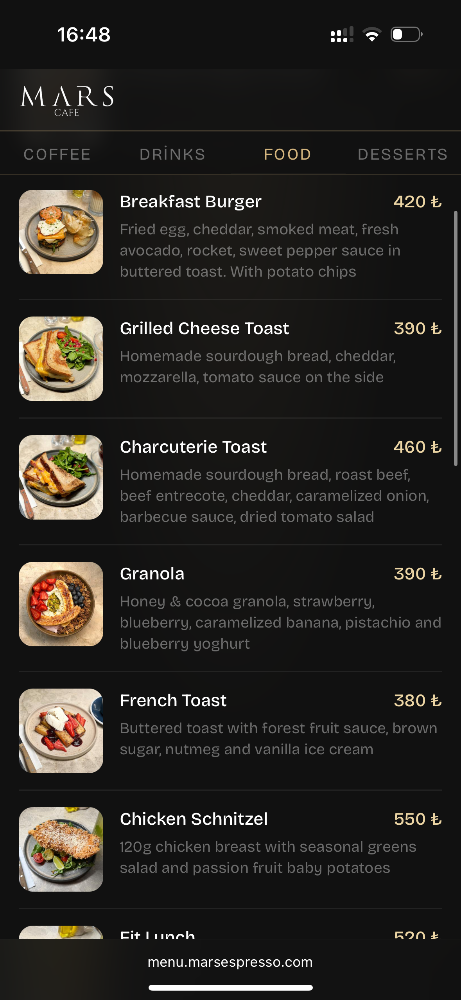
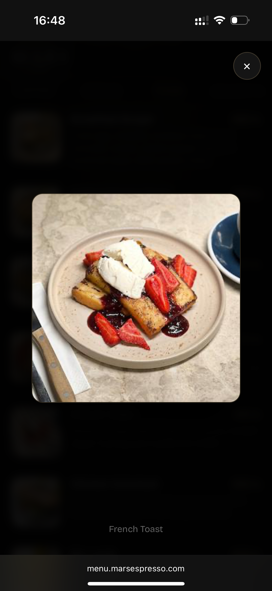

# ☕️ Mars — Digital Menu

A single-page digital menu for **Mars Coffee & Kitchen** (Istanbul). Built in **one day**, with one goal: the manager should never have to touch code to update prices or dishes.

So instead of a CMS, an admin panel, or a database — the menu *is* a Google Sheet. The manager edits rows in a spreadsheet; the page reads them live as CSV and renders instantly.

---

## ✨ Features

- **Content lives in Google Sheets** — add a dish, change a price, mark something sold out, all from a phone in a normal spreadsheet
- **No backend, no build step** — one `index.html` file: HTML, CSS, and JS inline, fetched straight off a static host
- **Bilingual (TR/EN)** — every row carries a Turkish and English name/description; `?lang=en` or `?lang=tr` switches instantly, falling back to whichever language is filled in
- **Sold-out handling** — an `available` column greys out a dish and tags it "Tükendi / Sold out" without removing it from the menu
- **Photo lightbox** — tap a dish photo to zoom; missing photos fall back to a category icon (coffee / drinks / food / desserts) instead of a broken image
- **Sample data fallback** — if the sheet is empty or unreachable, the page shows demo dishes with a "connect your Google Sheet" ribbon instead of a blank screen
- **Mobile-first, sticky nav** — category tabs stick under the header so switching sections never requires scrolling back up

---

## 🛠 Tech Stack

| Layer | Tech |
|---|---|
| Frontend | Vanilla HTML/CSS/JS — no framework, no dependencies |
| Database | Google Sheets, published as CSV |
| Font | Bricolage Grotesque (Google Fonts) |
| Hosting | Any static host (the whole site is one file + an image) |

---

## 📋 How content management works

1. Open the Google Sheet and add a row per dish with columns: `group_tr`, `group_en`, `name_tr`, `name_en`, `description_tr`, `description_en`, `price`, `photo`, `available`
2. **File → Share → Publish to web** → choose the sheet → CSV → copy the link
3. Paste that link into `CONFIG.sheetCsvUrl` in [index.html](index.html)
4. Done — every edit to the sheet shows up on the next page load, no redeploy needed

Categories (`GROUPS` in [index.html](index.html)) and currency (`CONFIG.currency`) are configured the same way, directly in the script block at the top of the file.

---

## 📸 Screenshots

---

## 🔐 Notes

- `CONFIG.sheetCsvUrl` points at a *published* (read-only, public) sheet — no credentials are needed or stored client-side
- All photos are hot-linked from the `photo` column (e.g. Unsplash or a Drive/Imgur link); the [photos/](photos) folder holds the original dish images used to populate the sheet
